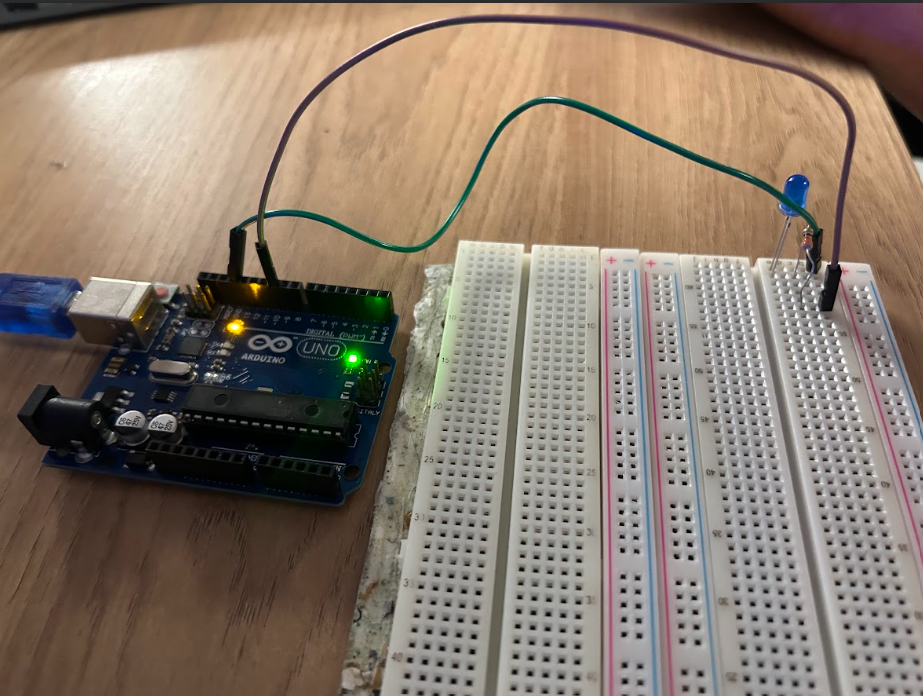
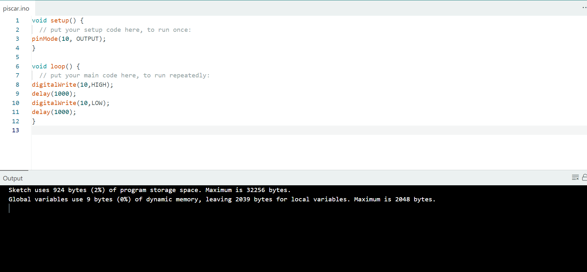

# Blink LED Interno — Parte 1

Essa primeira parte do projeto foi a minha introdução prática ao Arduino. O objetivo era simples: **fazer o LED piscar** usando a IDE do Arduino e entender o básico da programação e do funcionamento da placa.

---

##  O que eu fiz

Segui passo a passo o vídeo **“Projeto Arduino Pisca Led”** do canal *Como Fazer as Coisas*. O vídeo mostra todo o processo desde a montagem até o envio do código para a placa. Foi por ele que consegui fazer tudo funcionar direitinho.

 **Link do vídeo que usei como referência:** [https://www.youtube.com/watch?v=t0tCMcDhbZE](https://www.youtube.com/watch?v=t0tCMcDhbZE)

---

## 🔌 Materiais que usei

* 1 placa **Arduino Uno**
* 1 cabo **USB**
* 1 **LED** (usei azul)
* 1 **resistor de 100 ohms**
* 1 **protoboard**
* **Fios jumper** 

---

## Como montei

1. Conectei o pino GND do Arduino na linha azul (–) da protoboard.
2. Liguei o pino 10 do Arduino à linha onde está o LED.
3. Coloquei o LED com a perna menor no GND e a maior no resistor.
4. O resistor de 100 ohms liguei entre o LED e o fio vermelho que vem do pino 10.

---

## 💻 Código usado

```cpp
// Projeto Blink LED Externo (pino 10)
void setup() {
  pinMode(10, OUTPUT); // define o pino 10 como saída
}

void loop() {
  digitalWrite(10, HIGH); // acende o LED
  delay(1000);            // espera 1 segundo
  digitalWrite(10, LOW);  // apaga o LED
  delay(1000);            // espera 1 segundo
}
```

Depois de enviar esse código, o LED começou a piscar certinho, acendendo e apagando de 1 em 1 segundo.

---

## Evidências

Coloquei aqui as imagens e o vídeo mostrando o projeto funcionando:

### Montagem física
<p align="center">
  
</p>

### Código na IDE
<p align="center">
  
</p>

* [vídeo curto mostrando o pisca-pisca- CLIQUE AQUI](https://drive.google.com/file/d/19VkqwkrVP3mxRvWk_f66L1Qg0p5GGJa4/view?usp=sharing)

---

## Observações pessoais

Achei bem tranquilo de entender depois que vi o vídeo, mas precisei testar umas 3 vezes até o LED realmente começar a piscar. No começo achei que estava com problema de conexão, mas era só o resistor que eu tinha oegado errado. Depois de ajustar, funcionou perfeito.

# Blink LED Externo — Parte 2
[Link Tinkercad](https://www.tinkercad.com/things/dcOAqZliLeQ/editel?returnTo=%2Fdashboard&sharecode=Iib0FkBeBTkhuiUKxx6FZUtjZpbqStR5Z_ikLOZ21EI)
